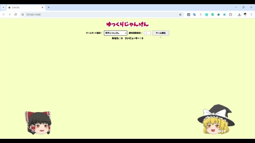

# ①ゆっくりじゃんけん

## ②説明
- 「通常のじゃんけん」と「両手じゃんけん」を選んで遊ぶことができます

## ③アプリのデプロイURL
https://ynproject.github.io/Day3Janken/

## ④アプリのログイン用IDまたはPassword（ある場合）
- ID: 今回無し
- PW: 今回無し

## ⑤工夫した点・こだわった点
- ２つのじゃんけんモードを選んで遊べる点
- pc、タブレット（iPadMini）、スマホ（iPhone14pro）のレスポンシブ対応をした点
- 勝敗の状況（個々の勝敗、完全勝利まで自分のリーチ、相手のリーチ、両者リーチ、完全勝利、完全敗北）でゆっくりの表情を変えた点

## ⑥難しかった点・次回トライしたいこと（又は機能）
- CSSが難しい。バランスがあまりよくないので練習したい。

## ⑦フリー項目（感想、シェアしたいこと等なんでも）
ゆっくりの画像とじゃんけんの手の画像は.gitignoreで除外しています。
2つのゲームモードのプレイイメージです

| 通常じゃんけん | 両手じゃんけん |
|:-------------:|:--------------------:|
|  |  |
